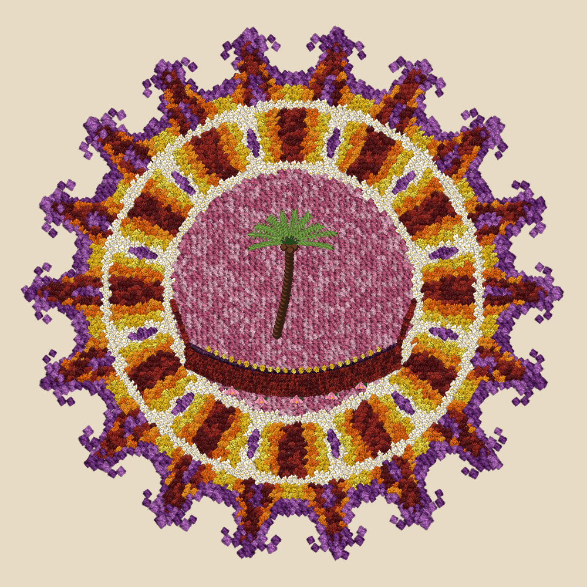

# Digital Pookalam – Code-A-Pookalam 2026
A digital Pookalam created using Python and Pygame for the TinkerHub Saintgits Code-A-Pookalam 2026 challenge.

## About the Project
This project recreates the colourful and festive spirit of a traditional Onam Pookalam entirely through code.
The design is generated using Python and Pygame without using any PNG/JPG flower tiles or pre-made flower graphics. The flowers, petals, leaves, patterns and decorative elements are generated programmatically using shapes, loops and mathematical calculations.
The design includes:
- Marigold-style flowers
- Jasmine-style flowers
- Chrysanthemum-style flowers
- Petal-shaped outer patterns
- Floral rings and geometric patterns
- A traditional Kerala boat (Vallam)
- A coconut tree
- Lotus flowers

## Technologies Used
- Python
- Pygame
- Math
- Random

## How It Works
Individual flowers are generated by combining multiple code-drawn petals into flower heads.
Loops, trigonometry, polar coordinates and procedural placement are then used to arrange the flowers into the final circular Pookalam pattern.

## How to Run
Install Pygame:
```bash
pip install pygame
Run the program:
```bash
python main.py
```
## 📸inal Pookalam


## Happy Onam!
Created for Code-A-Pookalam 2026 by TinkerHub Saintgits.
